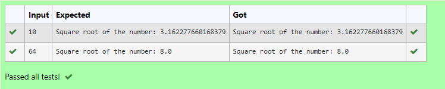

# Find the square root of a number

## AIM:
To write a program to find the square root of a number.

## Equipments Required:
1. Hardware – PCs
2. Anaconda – Python 3.7 Installation / Moodle-Code Runner

## Algorithm

### Step 1:
Define a function.

### Step 2:
Assign number_iters = 100 in the function to perform 100 iteratios.

### Step 3:
Set i = 0.

### Step 4:
Calculate  number = 0.5 * (number + a / number) for 100 iterations.

### Step 5:
Return number

## Program:
```
Program to find the square root for the given number(newton's method) using function.
Developed by: Sarankumar J
RegisterNumber:  21500780
def newton_method(x, x_iters = 100):

    for i in range(x_iters): 

         x=0.5*(x+a/x)

    return x

a=int(input())

print("Square root of the number:",newton_method(a))
```

## Output:



## Result:
Thus the program to find the square root for the given number(newton's method) using function is written and verified using python programming. Sucessfully Finished
